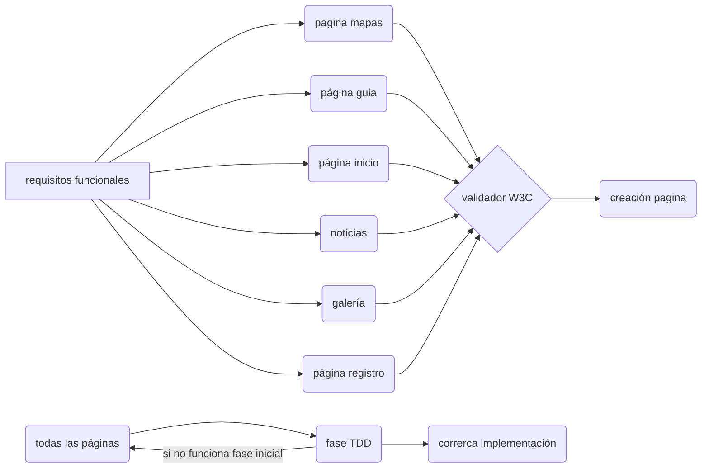

## Trabajo Web LLMM
### Documento requisitos funcionales.

 - inicio.
	Teníamos en mente 3 posibles páginas(de un videojuegos, de las criptomonedas o una página de chistes ). Nos centramos en que podíamos hacer y en cual nos daría mas juego a la hora de aplicar **CSS y JS** . Fuimos probando por separado que podíamos hacer y cual no daba **mas libertad** a la hora de armarla, así que nos quedamos con la de videojuegos. Teníamos muchas ideas, el problema viene cuando los armas y no hacen lo que tenias pensado. La base era  una pagina inicial donde estuviesen las noticias, una guía, gameplays(vídeos de gente jugando), un sorteo y un registro. Todo esto pensado para poder dar uso a lo aprendido de **CSS y JS** .
	Al principio fue probar que podíamos hacer y como lo llevaríamos a cabo, nuestras investigaciones nos llevaron a muchos lados usando frameworks para poder hacerlas y a las limitadas herramientas que teníamos se buscaron otras vías. La página principal se hizo el contenido para luego buscar que efecto agregarle, se descarto la pagina de sorteo y se agrego una de mapa. La pagina de noticias da uso de JS para mostrar mas o menos noticias, la de registro es mas compleja usando estado, comprobación de los inputs y usando **CSS y JS** para conseguir cambios en el momento de su uso, el mapa presenta un JS que usa una lupa para ver mejor la imagen y la guía presenta equipaciones con un efecto para ver características a su lado pasando el mouse por encima de la imagen. Agregamos y quitamos cosas sobre la marcha(mientras la terminamos)determinado por el factor si funcionaba o no algunas cosas estabas bien en efecto pero no venían al conjunto de la página. 

##  diagrama

	

 - Final
	 se descartaron algunas páginas por su mal funcionamiento y no poder repararla para que quedaran bien. aunque gracias a Adrian que me ayudo a mejorar las cosas que hacia pudimos entregar algo que funciona y combina con la página. el trabajo nos ayudo a ver como funcionan muchas cosas y también darnos cuenta cuanto nos falta por aprender. al final fueron 4 paginas acabadas.

**integrantes:**
**Adrian Carmona Belmonte**
**Alex Olmos Ceron**